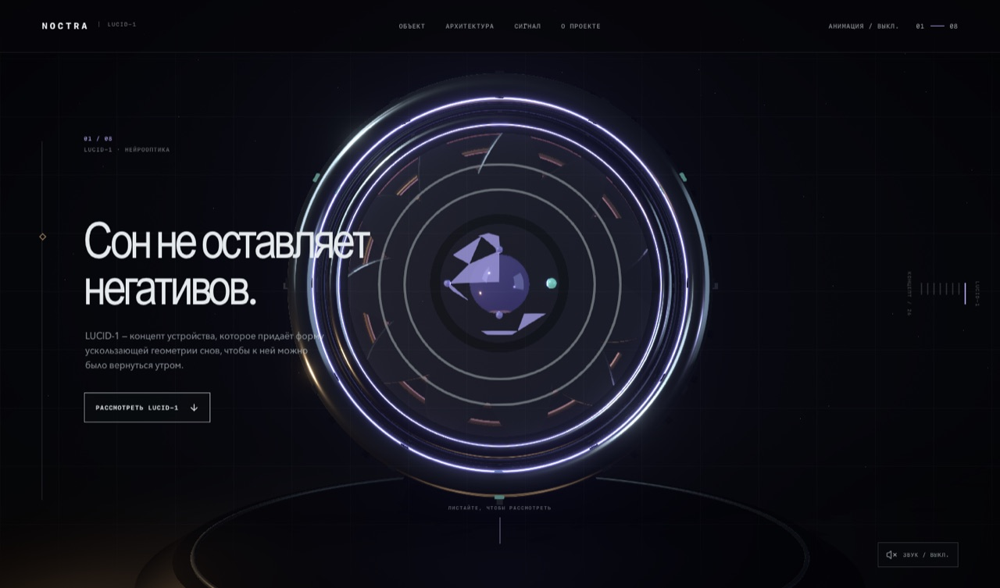
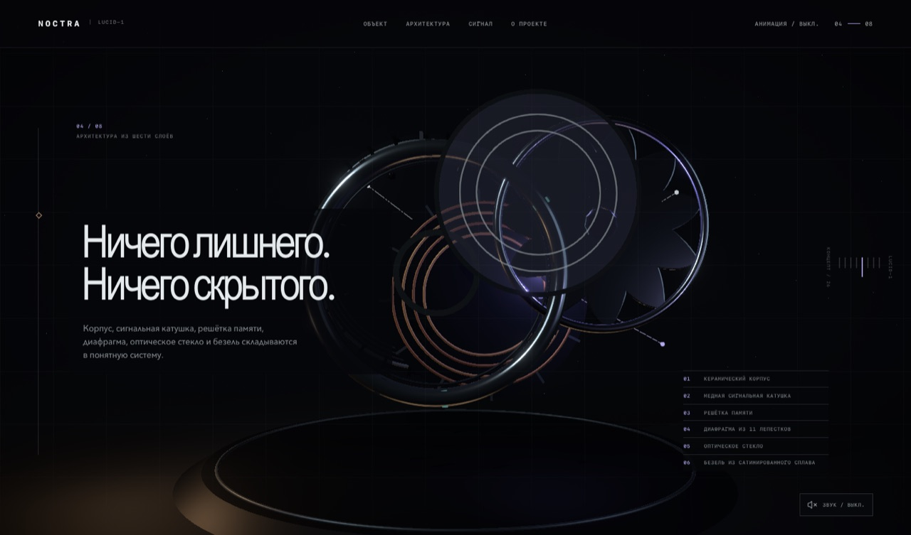
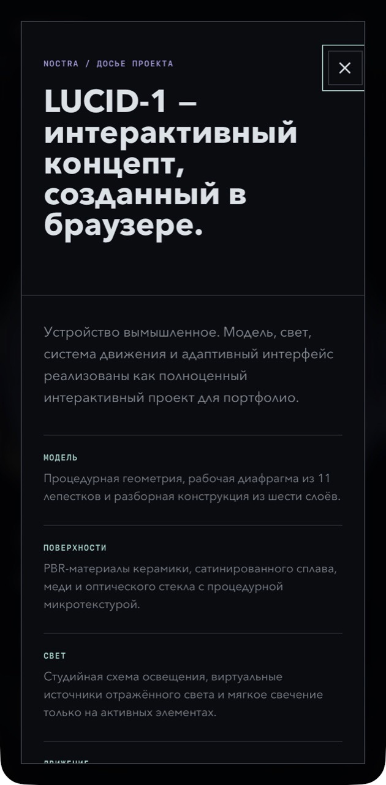

  

  
  &nbsp;
  

  
  

---

# 🟣 NOCTRA / LUCID-1

> **Интерактивное исследование вымышленного устройства через процедурный 3D, свет, материалы, звук и прокрутку.**

  
  
  
  
  

> ℹ️ NOCTRA и LUCID-1 — рабочие названия самостоятельного вымышленного концепта. Подробнее — в [NOTICE](./NOTICE.md).

## 🎯 Задача проекта

Не просто показать 3D-модель, а построить вокруг неё небольшой управляемый рассказ.

Пользователь постепенно знакомится с устройством — от общего силуэта до послойного технического разбора.

## 📌 Коротко

| | |
| :--- | :--- |
| 🧩 **Формат** | 8 связанных web-сцен |
| 🧊 **Объект** | Процедурная 3D-модель |
| 🎞️ **Движение** | Scroll-driven animation |
| 🔊 **Звук** | Web Audio |
| ✅ **Проверка** | Desktop + mobile-width WebKit |
| 🔒 **Исходники** | Не включены в витрину |

## 🖼️ Сцены

  

  

  

## 🧭 Сценарий исследования

1. 🌑 знакомство с силуэтом;
2. 💡 раскрытие объекта через свет;
3. 🧱 переход к материалам и структуре;
4. 💥 послойный инженерный разбор;
5. 📑 техническое досье;
6. 🎞️ переходы между сценами через прокрутку.

## 🧊 Визуальная система

- шестислойная процедурная модель;
- PBR-материалы;
- управляемое освещение;
- звуковые акценты;
- прокрутка как временная шкала;
- отдельный mobile dossier.

## ⚡ Производительность

### 🪶 Облегчённые параметры

Для менее производительных устройств предусмотрена более лёгкая конфигурация сцены.

### ♿ Reduced motion

Пользовательские настройки уменьшенной анимации учитываются отдельно.

### 🧯 WebGL fallback

При невозможности нормально отобразить WebGL интерфейс не должен превращаться в полностью сломанную страницу.

---

  

  <a href="https://github.com/mrjakeball"><strong>Профиль GitHub ↑</strong></a>

